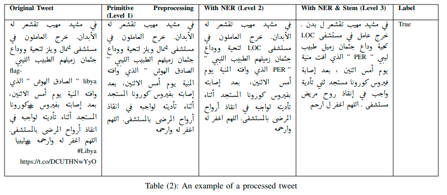
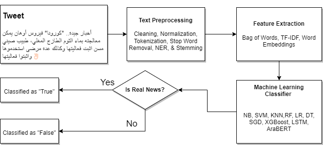
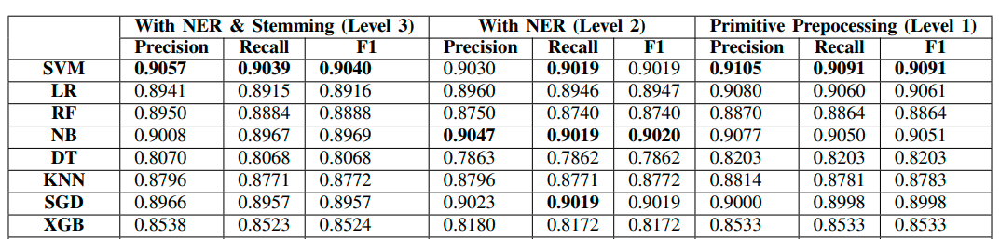

# Arabic Fake News Detection: Machine Learning Experiments

# Introducion

Social media has played the amplifier role of spreading misinformation that it turned into an Infodemic. Researchers utilized natural language processing and machine learning to detect and label misinformation on the network. Literature on fake news detection for content in English and Latin languages
using natural language is quite established however the research on Arabic Fake news detection is scarce. This paper contributes to the Arabic fake news detection research by comparing the effectiveness of several machine learning in classifying misinformed tweets based on linguistic features. 

For this experiment, A hybrid dataset with balanced labels was compiled from sources in the literature. Results reinforce the potential of applications
of machine learning in aiding the fact-checking process. Further research in building language resources and classification models is needed for the advancement of Arabic FND applications and
their associated fields.

# Project Description

This project interacts with the task of fake news detection as a binary classification problem. A binary classification problem in machine learning is predicting whether data points belong to a certain class or the other. In the case of this paper, the class labels are “True”, and “False”, referring to Arabic tweets related to COVID-19 containing verified information, and misinformation, respectively. 

This paper creates a hybrid datset that combines the ArCOV-19-Rumors dataset by Haouari et al [1], The Arabic dataset as part of NLP4IF2021 shared task [2], and AraCOVID19-MFH by Ameur et al [3], into one balanced dataset, containing an equal number of “True”tweets and “False”tweets.

Moreover, this paper compares the effectiveness of several machine learning models in classifying fake tweets against three levels of pre-processing procedures. Lastly, the paper also touches upon a few linguistic findings
from the hybrid dataset. 

# Methodology

## Data Collection

This paper experiments with fake news detection on a balanced dataset of tweets labeled as **True** or **False**. After surveying the literature, we have selected three datasets to be the source for the hybrid dataset used in this paper. Namely, ArCOV19-Rumors [1], AraCOVID19-MFH [2], and the Arabic dataset as part of NLP4IF-2021 shared task [3]. The three datasets contain COVID-19-related news tweets. The hybrid dataset contains in total of 4838 data points, with balanced class labels, 2419 data points for both "True”and“Fake" classes of tweets. The following tabels elucidates the number of data points extracted from each dataset.

| Source:ArCOV19-Rumors |            |          |
|-----------------------|------------|----------|
|                       |** Considered **| **Selected** |
| **# True tweets  **       | 1831       | 807      |
| **# False tweets   **     | 1753       | 1572     |
| **Total # tweets **       | 3584       | 2379     |

| Source:AraCOVID19-MFH |            |          |
|-----------------------|------------|----------|
|                       | **Considered** | **Selected** |
| **# True tweets**         | 2249       | 806      |
| **# False tweets**        | 459        | 459      |
| **Total # tweets  **      | 2708       | 1265     |

| Source:NLP4IF-Arabic  |            |          |
|-----------------------|------------|----------|
|                       | **Considered** | **Selected** |
| **# True tweets    **     | 1755       | 806      |
| **# False tweets**        | 388        | 388      |
| **Total # tweets  **      | 2143       | 1194     |

| Target:Hybrid dataset |            |      |
|-----------------------|------------|----------|
|                       |            | **Count**    |
|** # True tweets  **       |            | 2419     |
| **# False tweets **       |            | 2419     |
|                ** Tota**l |            | **4838   **  |

## Data Preprocessing

The hybrid dataset contains 4838 tweet and was split with 80% and 20% ratio to training and testing sets, respectively. Pandas DataFrames was used to represent the dataset, and Scikit-learn toolkit was used to train the classification models and predict the labels. Fake News Classification was
performed on three levels of preprocessing, described as
follows:
- **Primitive preprocessing (Level 1)**: This version of the dataset involved the procedures of cleaning, normalization and tokenization.

- **With NER (Level 2)**: Includes the procedures from Level 1, in addition to the labeling of named entities.

- **With NER & Stemming (Level 3): **Includes the procedures from Level 1 and Level 2, in addition to reducing lexical items to their stem form.

The following table illustrates an example of a tweet that undergone
text processing on all the three levels

## Machine Learning Models
To classify tweets from the hybrid dataset as verified news (True) or fake news (False), nine machine learning models were put into comparison. The results and the effectiveness of the models are discussed in next sections.

The following is a list of the models used in the experiment:
1. Support Vector Machine (SVM),
2. Logistic Regression (LR),
3. Decision Tree (DT),
4. Random Forest (RF),
5. eXtreme Gradient Boosting (XGB),
6. Stochastic Gradient Descent (SGD),
7. K-Nearest Neighbors (KNN), and
8) AraBERT [9].

The following figure introduces the model pipeline used in this experiment.

## Models Training

Ten-folds cross validation technique was used to validate the performance of the classifiers. Grid search procedure was used on some of the models to choose the best hyperparameter settings from a predefined list of model hyperparameters. The following lists the final hyperparamters used in the experiments.
- SVM: C=100, gamma=1, kernel=rbf.
- LR: Default parameters.
- NB: Default parameters.
- DT: Default parameters.
- RF: max depth=None, n estimators=1250.
- XGB: Default parameters.
- SGD: Default parameters.
- KNN: n neighbors=20, leaf size=30.

### Evaluation Measures

Accuracy, Precision, Recall and F1-score were used as metrics for measuring the performance of the classifiers.

# Results

The results indicate that using SVM has yielded the highest performance scores across all the three settings. The highest precision score was 91.05% obtained by SVM on level 1,followed by 90.57% achieved by the same model on Level3 settings. The runner-up model was Naive Bayes scoring 90.47% precision surpassing SVM on Level 2, and yielding a Recall and F1-score of 90.60% on Level 1. 

The following table lists the performance results obtained from predicting on the testing set using three levels of preprocessing.

# References

1. F. Haouari, M. Hasanain, R. Suwaileh, and T Elsayed, ”ArCOV-19: The First Arabic COVID-19 Twitter Dataset with Propagation Networks,”, In Proceedings of the Sixth Arabic Natural Language Processing Workshop, Kyiv, Ukraine (Virtual). Association for Computational Linguistics, pp. 82–91, 2021.

2. S. Shaar, F. Alam, G. Da San Martino, A. Nikolov, W. Zaghouani, P. Nakov, and A. Feldman, “Findings of the NLP4IF-2021 shared tasks on fighting the COVID-19 infodemic and censorship detection, Proceedings of the Fourth Workshop on NLP for Internet Freedom: Censorship, Disinformation, and Propaganda, 2021.

3. M. S. Hadj Ameur and H. Aliane, “AraCOVID19-MFH: Arabic COVID-19 Multi-label Fake News and Hate Speech Detection Dataset” Procedia Computer Science, vol. 189, pp. 232–241, 2021
